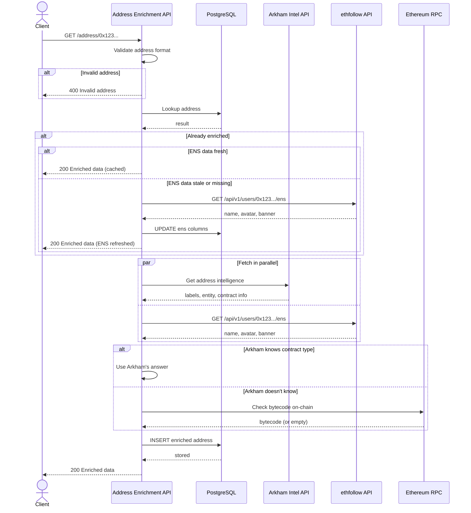

# Address Enrichment Service

A service that enriches Ethereum addresses with labels from Arkham Intel API, ENS data from ethfollow, and determines whether addresses are EOAs or contracts.

## Features

- **Arkham Labels**: Fetches entity names and labels from Arkham Intel API
- **ENS Resolution**: Fetches ENS name, avatar, and banner via ethfollow API
- **Address Type Detection**: Determines if an address is an EOA or contract via RPC
- **Hybrid Caching**: Arkham data is stored permanently. ENS data is cached with a configurable TTL and refreshed automatically.
- **OpenAPI Documentation**: Swagger UI available at `/docs`

## API Endpoints

### `GET /address/:address`

Returns enriched data for a single Ethereum address.

**Response:**

```json
{
  "address": "0x245445940b317e509002eb682e03f4429184059d",
  "isContract": false,
  "arkham": {
    "entity": "Upbit",
    "entityType": "cex",
    "label": "Cold Wallet"
  },
  "ens": {
    "name": "example.eth",
    "avatar": "https://euc.li/example.eth",
    "banner": "https://i.imgur.com/example.png"
  },
  "createdAt": "2024-01-20T10:30:00.000Z"
}
```

> `ens` is `null` when the address has no ENS name.

### `POST /addresses`

Batch endpoint for resolving multiple addresses at once (max 100 per request).

**Request:**

```json
{
  "addresses": [
    "0x245445940b317e509002eb682e03f4429184059d",
    "0x1234567890abcdef1234567890abcdef12345678"
  ]
}
```

**Response:**

```json
{
  "results": [
    {
      "address": "0x245445940b317e509002eb682e03f4429184059d",
      "isContract": false,
      "arkham": {
        "entity": "Upbit",
        "entityType": "cex",
        "label": "Cold Wallet"
      },
      "ens": {
        "name": "example.eth",
        "avatar": "https://euc.li/example.eth",
        "banner": "https://i.imgur.com/example.png"
      },
      "createdAt": "2024-01-20T10:30:00.000Z"
    }
  ],
  "errors": [
    {
      "address": "0x1234567890abcdef1234567890abcdef12345678",
      "error": "Failed to fetch from Arkham API"
    }
  ]
}
```

### `GET /health`

Health check endpoint.

## Environment Variables

| Variable                | Description                        | Required                                           |
| ----------------------- | ---------------------------------- | -------------------------------------------------- |
| `DATABASE_URL`          | PostgreSQL connection string       | Yes                                                |
| `ARKHAM_API_KEY`        | Arkham Intel API key               | Yes                                                |
| `ARKHAM_API_URL`        | Arkham API base URL                | No (default: `https://api.arkhamintelligence.com`) |
| `RPC_URL`               | Ethereum RPC URL                   | Yes                                                |
| `ANTICAPTURE_API_URL`   | Anticapture GraphQL API URL        | Yes (for sync command)                             |
| `ENS_CACHE_TTL_MINUTES` | TTL in minutes for cached ENS data | No (default: `60`)                                 |
| `PORT`                  | Server port                        | No (default: `3001`)                               |

## Development

```bash
# From monorepo root
pnpm address-enrichment dev

# Run database migrations
pnpm address-enrichment db:push

# Type check
pnpm address-enrichment typecheck

# Lint
pnpm address-enrichment lint
```

## Sync Command

Batch-sync top addresses from Anticapture API (delegates + token holders):

```bash
# Sync top 100 delegates and top 100 token holders
pnpm address-enrichment sync --limit 100

# Sync only delegates
pnpm address-enrichment sync --limit 50 --delegates-only

# Sync only token holders
pnpm address-enrichment sync --limit 50 --holders-only

# Show help
pnpm address-enrichment sync --help
```

The sync command:

- Fetches top addresses from Anticapture API (delegates by voting power, holders by balance)
- Skips addresses already in the database (no re-fetching)
- Only calls Arkham API and RPC for new addresses
- Deduplicates addresses that appear in both lists

## Database Schema

The service uses a single table `address_enrichment`:

- `address` (PK): Ethereum address (42 chars)
- `is_contract`: Boolean indicating if address is a contract
- `arkham_entity`: Entity name from Arkham (e.g., "Upbit", "Binance")
- `arkham_entity_type`: Entity type from Arkham (e.g., "cex", "dex", "defi")
- `arkham_label`: Specific label from Arkham (e.g., "Cold Wallet", "Hot Wallet")
- `ens_name`: ENS name (e.g., "vitalik.eth")
- `ens_avatar`: ENS avatar URL
- `ens_banner`: ENS banner/header URL
- `ens_updated_at`: Timestamp when ENS data was last fetched (used for TTL)
- `created_at`: Timestamp when the record was first created

> Arkham data is permanent. ENS data is refreshed when `ens_updated_at` is older than `ENS_CACHE_TTL_MINUTES`.

## Data Flow

1. Request comes in for `GET /address/0x123...`
2. Check if address exists in database
3. If found:
   - Arkham data: return as-is (permanent)
   - ENS data: check `ens_updated_at` against TTL
     - Fresh: return cached ENS data
     - Stale or missing: refetch from ethfollow API, update row
4. If not found:
   - Call Arkham API and ethfollow API in parallel
   - If Arkham doesn't have contract info, fall back to RPC `getCode`
   - Store everything in PostgreSQL
   - Return enriched data

## Sequence Diagram — `GET /address/:address`



## Summary

Architecture overview:

- Framework: Hono with OpenAPI/Zod validation
- Database: PostgreSQL with Drizzle ORM
- External APIs: Arkham Intel API, ethfollow (ENS), Ethereum RPC, Anticapture GraphQL API
- Features: Single and batch enrichment endpoints, hybrid caching (permanent Arkham + TTL-based ENS), sync script
- Data flow: Check DB → Fetch Arkham + ENS in parallel → Fallback to RPC → Store → Return
