# Address Enrichment Service

A service that enriches Ethereum addresses with labels from Arkham Intel API and determines whether addresses are EOAs or contracts.

## Features

- **Arkham Labels**: Fetches entity names and labels from Arkham Intel API
- **Address Type Detection**: Determines if an address is an EOA or contract via RPC
- **Permanent Storage**: Data is stored permanently in PostgreSQL (no TTL, no cache invalidation)
- **OpenAPI Documentation**: Swagger UI available at `/docs`

## API Endpoints

### `GET /address/:address`

Returns enriched data for a single Ethereum address.

**Response:**

```json
{
  "address": "0x245445940b317e509002eb682e03f4429184059d",
  "isContract": false,
  "arkham": {
    "entity": "Upbit",
    "entityType": "cex",
    "label": "Cold Wallet"
  },
  "createdAt": "2024-01-20T10:30:00.000Z"
}
```

### `POST /addresses`

Batch endpoint for resolving multiple addresses at once (max 100 per request).

**Request:**

```json
{
  "addresses": [
    "0x245445940b317e509002eb682e03f4429184059d",
    "0x1234567890abcdef1234567890abcdef12345678"
  ]
}
```

**Response:**

```json
{
  "results": [
    {
      "address": "0x245445940b317e509002eb682e03f4429184059d",
      "isContract": false,
      "arkham": {
        "entity": "Upbit",
        "entityType": "cex",
        "label": "Cold Wallet"
      },
      "createdAt": "2024-01-20T10:30:00.000Z"
    }
  ],
  "errors": [
    {
      "address": "0x1234567890abcdef1234567890abcdef12345678",
      "error": "Failed to fetch from Arkham API"
    }
  ]
}
```

### `GET /health`

Health check endpoint.

## Environment Variables

| Variable              | Description                  | Required                                           |
| --------------------- | ---------------------------- | -------------------------------------------------- |
| `DATABASE_URL`        | PostgreSQL connection string | Yes                                                |
| `ARKHAM_API_KEY`      | Arkham Intel API key         | Yes                                                |
| `ARKHAM_API_URL`      | Arkham API base URL          | No (default: `https://api.arkhamintelligence.com`) |
| `RPC_URL`             | Ethereum RPC URL             | Yes                                                |
| `ANTICAPTURE_API_URL` | Anticapture GraphQL API URL  | Yes (for sync command)                             |
| `PORT`                | Server port                  | No (default: `3001`)                               |

## Development

```bash
# From monorepo root
pnpm address-enrichment dev

# Run database migrations
pnpm address-enrichment db:push

# Type check
pnpm address-enrichment typecheck

# Lint
pnpm address-enrichment lint
```

## Sync Command

Batch-sync top addresses from Anticapture API (delegates + token holders):

```bash
# Sync top 100 delegates and top 100 token holders
pnpm address-enrichment sync --limit 100

# Sync only delegates
pnpm address-enrichment sync --limit 50 --delegates-only

# Sync only token holders
pnpm address-enrichment sync --limit 50 --holders-only

# Show help
pnpm address-enrichment sync --help
```

The sync command:

- Fetches top addresses from Anticapture API (delegates by voting power, holders by balance)
- Skips addresses already in the database (no re-fetching)
- Only calls Arkham API and RPC for new addresses
- Deduplicates addresses that appear in both lists

## Database Schema

The service uses a single table `address_enrichment` to permanently store enriched address data:

- `address` (PK): Ethereum address (42 chars)
- `is_contract`: Boolean indicating if address is a contract
- `arkham_entity`: Entity name from Arkham (e.g., "Upbit", "Binance")
- `arkham_entity_type`: Entity type from Arkham (e.g., "cex", "dex", "defi")
- `arkham_label`: Specific label from Arkham (e.g., "Cold Wallet", "Hot Wallet")
- `created_at`: Timestamp when data was first fetched

## Data Flow

1. Request comes in for `GET /address/0x123...`
2. Check if address exists in database
3. If found: return stored data immediately
4. If not found:
   - Call Arkham API for labels/entity/contract info
   - If Arkham doesn't have contract info, fall back to RPC `getCode`
   - Store in PostgreSQL (permanent)
   - Return enriched data

## Activity Diagram

```mermaid
flowchart TD
    %% ── Entry Points ──
    Start((Client Request))
    SyncStart((CLI: sync command))

    Start --> RouteCheck{Route?}
    RouteCheck -->|"GET /address/:address"| SingleFlow
    RouteCheck -->|"POST /addresses"| BatchFlow
    RouteCheck -->|"GET /health"| HealthCheck["Return { status: ok }"]

    %% ══════════════════════════════════════
    %% Single Address Flow
    %% ══════════════════════════════════════
    subgraph SingleFlow["Single Address Enrichment"]
        direction TB
        S1["Validate address (viem isAddress)"]
        S1 -->|Invalid| S1Err["Return 400: Invalid Ethereum address"]
        S1 -->|Valid| S2["Normalize address (lowercase)"]
        S2 --> S3{"Address exists\nin PostgreSQL?"}
        S3 -->|Yes| S4["Return stored data"]
        S3 -->|No| S5["Call Arkham Intel API\nGET /intelligence/address/:addr"]
        S5 --> S6{"Arkham response?"}

        S6 -->|"200 OK"| S7["Parse response\n(Zod schema validation)"]
        S6 -->|"404 Not Found"| S8["Set entity/label = null\nisContract = null"]
        S6 -->|"Other error / Network failure"| S9["arkhamData = null"]

        S7 -->|Parse success| S10{"Arkham has\ncontract info?"}
        S7 -->|Parse failure| S9
        S8 --> S10

        S10 -->|Yes| S11["Use Arkham's isContract value"]
        S10 -->|No| S12["RPC fallback:\ngetCode(address)"]
        S12 --> S13{"Bytecode exists\nand ≠ 0x?"}
        S13 -->|Yes| S14["isContract = true"]
        S13 -->|No / Error| S15["isContract = false (conservative)"]
        S14 --> S16
        S15 --> S16
        S11 --> S16

        S9 --> S10b{"arkhamData = null\n→ Need contract check"}
        S10b --> S12b["RPC fallback:\ngetCode(address)"]
        S12b --> S13b{"Bytecode exists\nand ≠ 0x?"}
        S13b -->|Yes| S14b["isContract = true"]
        S13b -->|No / Error| S15b["isContract = false"]
        S14b --> S16
        S15b --> S16

        S16["INSERT into PostgreSQL\n(ON CONFLICT DO NOTHING)"]
        S16 --> S17{"Insert returned\na row?"}
        S17 -->|Yes| S18["Return enriched data"]
        S17 -->|No: race condition| S19["SELECT from PostgreSQL\n(concurrent insert won)"]
        S19 --> S18
    end

    %% ══════════════════════════════════════
    %% Batch Address Flow
    %% ══════════════════════════════════════
    subgraph BatchFlow["Batch Address Enrichment"]
        direction TB
        B1["Validate body\n(1–100 addresses, all valid)"]
        B1 -->|Invalid| B1Err["Return 400"]
        B1 -->|Valid| B2["Deduplicate & lowercase"]
        B2 --> B3["Split into batches\n(concurrency = 10)"]
        B3 --> B4["For each batch:\nPromise.allSettled(getAddressEnrichment)"]
        B4 --> B5{"Each result\nstatus?"}
        B5 -->|fulfilled| B6["Add to results[]"]
        B5 -->|rejected| B7["Add to errors[]"]
        B6 --> B8
        B7 --> B8
        B8["Return { results, errors }"]
    end

    B4 -. "Each address follows\nSingle Address Flow" .-> S2

    %% ══════════════════════════════════════
    %% Sync Command Flow
    %% ══════════════════════════════════════
    subgraph SyncFlow["Sync Top Addresses (CLI)"]
        direction TB
        C1["Parse CLI args\n(--limit, --delegates-only, --holders-only)"]
        C1 --> C2["Init DB, Arkham, RPC,\nAnticapture clients"]
        C2 --> C3{"Fetch delegates?"}
        C3 -->|"Yes (not --holders-only)"| C4["Anticapture GraphQL:\ngetTopDelegates(limit)\norderBy votingPower desc"]
        C3 -->|No| C5
        C4 --> C5{"Fetch holders?"}
        C5 -->|"Yes (not --delegates-only)"| C6["Anticapture GraphQL:\ngetTopTokenHolders(limit)\norderBy balance desc"]
        C5 -->|No| C7
        C6 --> C7["Merge & deduplicate\ninto addressMap"]
        C7 --> C8["For each address\n(sequential, 100ms delay)"]
        C8 --> C9{"Address exists\nin PostgreSQL?"}
        C9 -->|Yes| C10["Log ⏭️ skip\nexistingCount++"]
        C9 -->|No| C11["Enrich via Arkham API\n+ RPC fallback\n→ INSERT into DB"]
        C11 --> C12["Log ✅ new\nnewCount++"]
        C10 --> C13{"More addresses?"}
        C12 --> C13
        C11 -.->|Error| C14["Log ❌\nerrorCount++"]
        C14 --> C13
        C13 -->|Yes| C8
        C13 -->|No| C15["Print summary\n& exit"]
    end

    SyncStart --> SyncFlow
```


