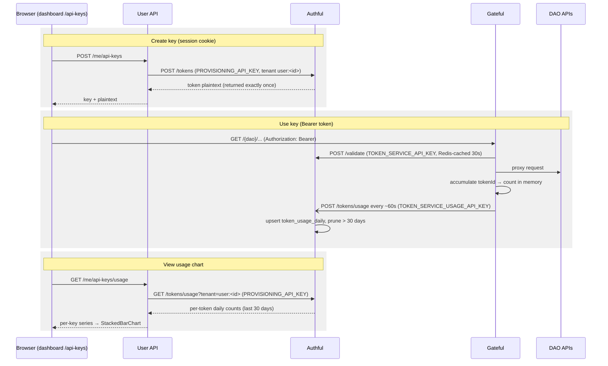

# @anticapture/user-api

User identity & session service for the Anticapture platform. Owns
authentication (SIWE now; Google OAuth and magic link to follow) and off-chain
user data (draft proposals, user settings — added in later steps).

## Position in the architecture

Reached only through the dashboard's `/api/user/*` Next proxy (HTTP-only session
cookies). It does **not** sit behind Gateful — Gateful stays the API-key data
plane for the DAO APIs. The User API talks to Authful east-west (private network) to
mint user-scoped API keys.

```
Browser ──/api/user/*──> User API (better-auth: SIWE/Google/magic-link) ──> User API DB
Browser ──/api/gateful/*─> Gateful ──> DAO APIs (read models)
User API ──(east-west, provisioning key)──> Authful
```

## Auth model

- **SIWE** via better-auth's `siwe` plugin. One better-auth instance per host in
  `AUTH_SIWE_DOMAINS` so main and whitelabel domains each sign with their real
  host (the plugin binds a message to a single domain — this preserves SIWE's
  anti-phishing property across domains). Sessions are host-only cookies, so a
  user re-signs when moving between domains; find-or-create by address means it
  is the **same account** across them.
- EOA and EIP-1271 / ERC-6492 (smart-contract wallets) verified via viem.

## API keys & usage

Self-service API keys are minted in Authful under the user's own tenant
(`user:<id>`); this service stores only ownership + label. Gateful counts every
authenticated request (it's the only component that sees them all — Authful
validations are Redis-cached, so `/validate` traffic undercounts) and flushes
per-key daily totals to Authful with a **usage-only** key that cannot mint or
revoke. The dashboard reads the last 30 days back through this service.



Each Authful credential is scoped to its caller's least privilege: the User API
holds the provisioning key (`user:*` mint/revoke/read), internet-facing Gateful
holds only the validate + usage-recording keys.

## Database

The User API runs on its **own** Postgres database (default `public` schema). The
better-auth core tables are generated by the better-auth CLI:

```bash
pnpm --filter @anticapture/user-api auth:generate   # writes src/database/auth-schema.ts
pnpm --filter @anticapture/user-api db:generate      # drizzle migration
pnpm --filter @anticapture/user-api db:migrate
```

## Env

See `.env.example`. Required: `DATABASE_URL`, `BETTER_AUTH_SECRET`,
`AUTH_SIWE_DOMAINS`, `RPC_URL`.

> **There is no `BETTER_AUTH_URL`.** The service serves many frontend origins
> (localhost, the main domain, whitelabel hosts), so a single base URL can't be
> right. `AUTH_SIWE_DOMAINS` is the one list of allowed hosts, and per host we
> derive the SIWE domain, the better-auth `baseURL` (cookie/CSRF scope —
> `https://<host>`, `http` for localhost), and the trusted-origin allowlist.
> better-auth mounts at `baseURL` + `basePath` (`/api/auth`); the dashboard
> proxy strips `/api/user` before forwarding, so the service receives
> `/api/auth/*` and the origin (no path) is exactly what's needed.

### Browser-facing URLs the service generates

better-auth self-generates some URLs the **browser** must be able to open:
the Google OAuth `redirect_uri` and the magic-link verify URL, both under
`{origin}/api/auth/*`. The dashboard serves them via a Next rewrite
(`/api/auth/:path*` → the `/api/user` proxy), and magic-link emails point at
the dashboard's `/auth/magic-link` interstitial (which triggers the verify
from the browser, so mail-pipeline prefetchers can't burn the single-use
token). The proxy, the rewrite and the interstitial all ship with the
dashboard PR — this service and that dashboard release deploy together.

Behind a managed edge (e.g. Railway) the dashboard proxy's host arrives as
`x-anticapture-host` (the edge overwrites `x-forwarded-*`); `PORT` must match
the generated domain's target port (4003).

## Preview environments (Railway PR envs)

Login-gated flows are reviewable from the Vercel preview link with a real
wallet. When `RAILWAY_ENVIRONMENT_NAME` is a PR preview (never
dev/production — derived from the deploy, not from config), **dynamic
hosts** activate: every Vercel preview URL is unique, so better-auth
instances for `*.vercel.app` hosts are built on demand instead of coming
from `AUTH_SIWE_DOMAINS`. All other hosts still fail closed, and signatures
are verified on-chain exactly like everywhere else.

Security posture: preview databases are ephemeral and empty, PR environments
must only inherit **throwaway** values (never real secrets — same rule as
authful's seeded preview token), and untrusted (fork) PRs get no preview
environment at all (see `tests.yaml`'s trust gate). Google OAuth stays off
in previews (its redirect URIs are registered per exact host); magic link
stays off unless a sandbox Resend key is provided.
